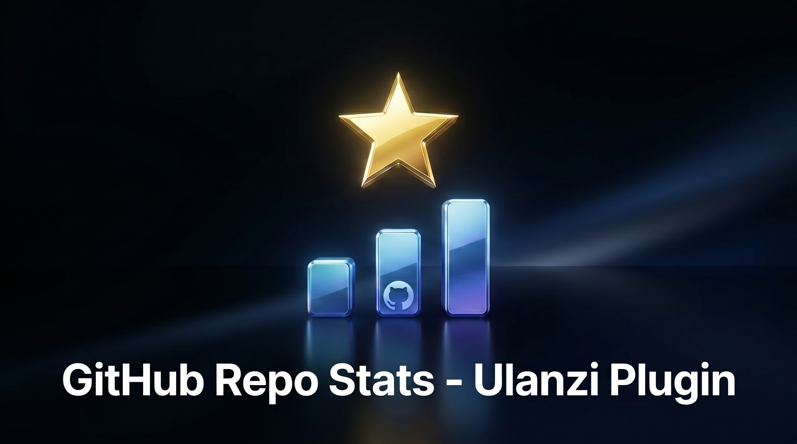
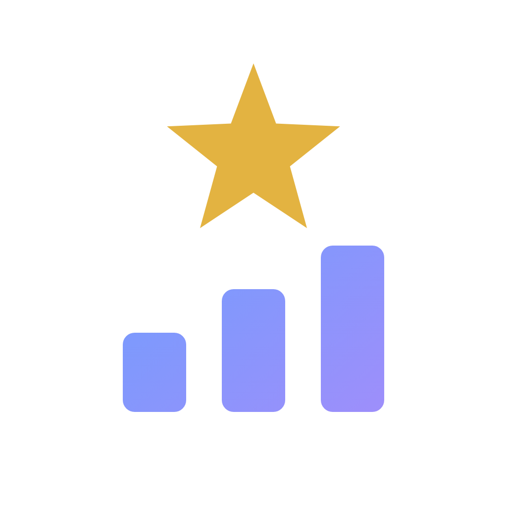
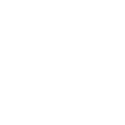
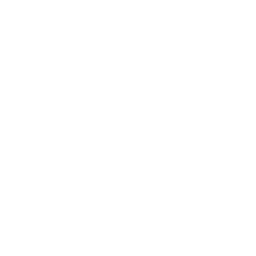
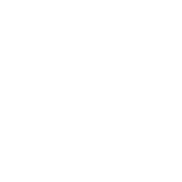
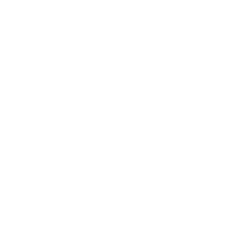
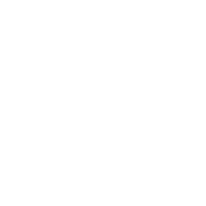
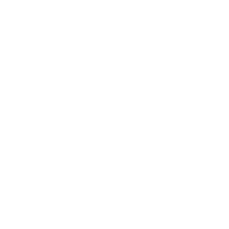

[](https://ulanzicommunitystore.narlei.com)

<div align="center">
<p align="center">
  
  
</p>

**Live GitHub monitors on your Ulanzi Deck — seven actions, one plugin.**

Stars, releases, commits, CI status, issues & PRs, profiles and your API quota — each on its own key. Press the key to cycle through the metrics.


</div>

---

## ✨ Seven actions

Each action is a separate key with its own icon. The key shows **one metric at a time, big and centered** — **press the key to cycle** to the next.

| Action | What it shows | Cycle (press the key) |
|--------|---------------|-----------------------|
|  **Repo Stats** | Any public repo | stars → forks → issues → watchers |
|  **Latest Release** | Newest release | version → downloads → published |
|  **Commit Activity** | Last 7 days | commits → last author → last time |
|  **CI / Actions** | Latest workflow run | status (✓/✗/running) → last run |
|  **Issues & PRs** | Open counts | issues → pull requests |
|  **User / Org** | Any profile | followers → repos → gists → following |
|  **API Rate Limit** | Your API quota | remaining → reset countdown |

---

## 🎨 Features

- **Press-to-cycle** carousel — one clear metric per key, with a matching icon and a dot indicator.
- **Marquee** — long repo/user names scroll automatically.
- **Auto-refresh** on a configurable interval (no key press needed).
- **8 color themes** (GitHub, Midnight, Carbon, Ocean, Grape, Mono, Paper, Snow), **4 vector fonts**, optional animated accent.
- **Optional token** — for private repos and a higher rate limit (5,000/h vs ~60/h).
- **Built-in tutorial** — a **?** button on every action opens a step-by-step guide for that function, localized.
- **11 languages** — English, Português (BR/PT), Español, Français, Deutsch, Italiano, 日本語, 한국어, 中文 (简/繁).
- **Cross-platform & light** — pure-JS (no native binaries); glyph caching + image dedup keep the deck idle when nothing changes.

---

## 🔑 GitHub token (optional)

Without a token, public data works fine but GitHub limits requests to ~60/hour.
Add a **fine-grained Personal Access Token** (read-only) in the action settings to:

- raise the limit to **5,000/hour**, and
- monitor **private** repositories.

The token is stored only in the action settings and is sent only to `api.github.com` over HTTPS — never logged or shared.

---

## 📦 Installation

**From the Ulanzi store:** search for **GitHub Repo Stats** and install.

**Manual:**
1. Download/clone this repository.
2. Copy the `com.github.repostats.ulanziPlugin` folder into your Ulanzi plugins directory:
   - **Windows:** `%AppData%\Ulanzi\UlanziDeck\Plugins\`
   - **macOS:** `~/Library/Application Support/Ulanzi/UlanziDeck/Plugins/`
3. Restart UlanziDeck Studio.

---

## 🗂️ Repository structure

```
com.github.repostats.ulanziPlugin/
├── manifest.json            # 7 actions
├── plugin/app.js            # backend: fetch + render + cache
├── property-inspector/
│   ├── inspector.html/js    # settings panel (adapts per action)
│   └── tutorial.html        # per-function guide (11 langs)
├── assets/icons/            # action + brand icons
├── <lang>.json × 11         # localization
├── LICENSE · THIRD-PARTY-LICENSES.md
└── node_modules/ (opentype.js, ws)
```

---

## 🛠️ Tech

- **Data:** GitHub REST + Search API. **Translation/fonts:** vector glyphs via `opentype.js`.
- **No telemetry**, no accounts — every request is read-only to GitHub.
- Performance: the static key body is cached and identical frames are never re-pushed to the deck.

---

## 📄 License

MIT © Jean Almeida — see [`LICENSE`](com.github.repostats.ulanziPlugin/LICENSE).
Third-party notices in [`THIRD-PARTY-LICENSES.md`](com.github.repostats.ulanziPlugin/THIRD-PARTY-LICENSES.md).
